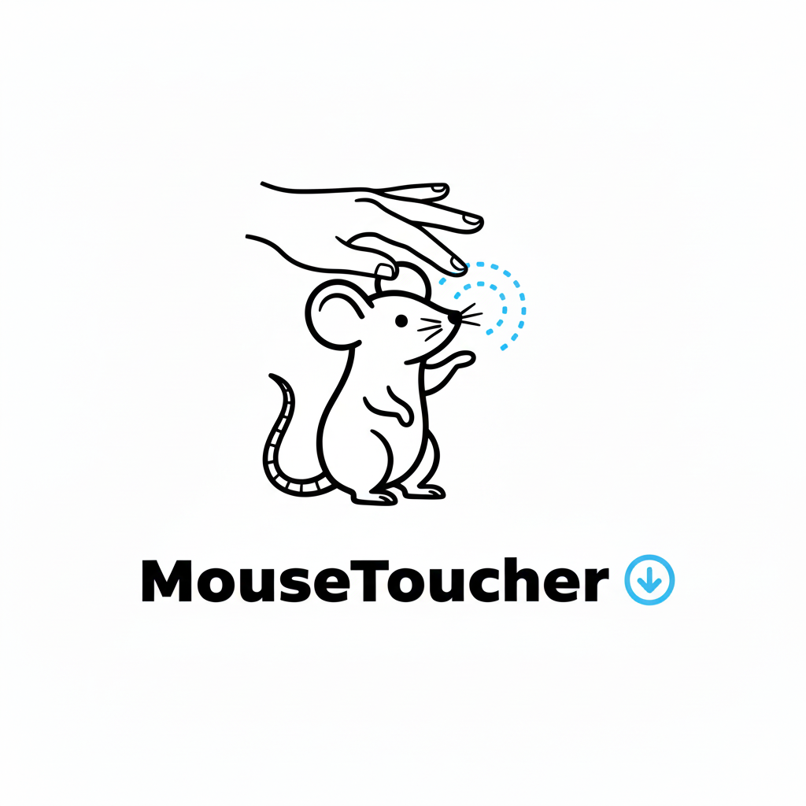

# Mouse Toucher

<picture>
  <source media="(prefers-color-scheme: dark)" srcset="mousetoucher-dark.png">
  <source media="(prefers-color-scheme: light)" srcset="mousetoucher-light.png">
  
</picture>

**Finally, tap-to-click for your Apple Magic Mouse!** (v1.1)

Mouse Toucher brings trackpad-style tap-to-click functionality to the Apple Magic Mouse. Simply tap the left or right side of your mouse surface to click - no more pressing down the button.

## ✨ Features

- 🖱️ **Tap left side** for left-click
- 🖱️ **Tap right side** for right-click
- ⚡ **Fast & responsive** - no noticeable delay
- 🎯 **Easy toggle** on/off from the menu bar
- 🔒 **Privacy-focused** - runs entirely on your Mac, no network access

## 📋 Requirements

- macOS 11.0 (Big Sur) or later
- Apple Magic Mouse (1st or 2nd generation)
- Your Magic Mouse must be connected via Bluetooth

## 🚀 Installation

### Option 1: Use Pre-Built Binary (Recommended)

A universal binary (works on both Apple Silicon and Intel Macs) is included in the `build` folder.

```bash
# Navigate to the repository
cd /path/to/mousetoucher-claude

# Copy to Applications
cp -r build/MouseToucher.app /Applications/
```

### Option 2: Build From Source

If you prefer to build it yourself:

```bash
cd /path/to/mousetoucher-claude
./build.sh   # Builds and ad-hoc codesigns the app so Accessibility permissions stick
cp -r build/MouseToucher.app /Applications/
```

### Grant Permissions

1. Open **MouseToucher** from your Applications folder
2. You'll see a permission request - click **"Open System Settings"**
3. In **Privacy & Security → Accessibility**, enable **MouseToucher** ✓
   - If the app is missing, click the **+** button and add it from `/Applications/MouseToucher.app`
4. Return to MouseToucher – it will begin working automatically once the toggle is on (no relaunch needed)

That's it! You'll see a mouse icon in your menu bar.

## 📖 How to Use

### Basic Usage

1. Look for the **mouse icon** 🖱️ in your menu bar (top-right of screen)
2. **Tap anywhere** on your Magic Mouse surface to click
   - Tap **left side** = normal click
   - Tap **right side** = right-click (context menu)
3. You can still click the mouse button normally - tapping is just an additional way to click

### Menu Bar Controls

Click the mouse icon in your menu bar to:

- **Enable/Disable** tap-to-click (checkmark shows when enabled)
- **View About** information
- **Quit** the app

### Tips

- 💡 Keep your taps **quick and light** for best results
- 💡 The dividing line between left/right is roughly in the center of the mouse
- 💡 To disable temporarily, click the menu bar icon and toggle it off

## 🔧 Auto-Start on Login (Optional)

To have MouseToucher start automatically when you log in:

1. Open **System Settings**
2. Go to **General → Login Items**
3. Click the **+** button
4. Select **MouseToucher** from your Applications folder
5. Click **Add**

Now MouseToucher will launch every time you start your Mac!

## ⚠️ Important Information

### About Private Frameworks

MouseToucher uses Apple's private **MultitouchSupport** framework to detect touches on your Magic Mouse. 

**What this means:**

- ✅ **Safe to use** - Many apps use this framework
- ✅ **Works great** on current macOS versions
- ❌ **Not on Mac App Store** - Apple doesn't allow private frameworks in the App Store
- ⚠️ **Future updates** - Could potentially break in a major macOS update (though unlikely based on history)

**Privacy:** The app only monitors your Magic Mouse touches. It doesn't collect data, access the internet, or send information anywhere.

### Accessibility Permissions

MouseToucher requires **Accessibility permissions** to:

1. **Detect** when you tap the Magic Mouse surface
2. **Send** click events to your Mac

These permissions are granted by you in System Settings and can be revoked at any time. The app cannot function without them.

## 🐛 Troubleshooting

### Taps aren't working

**Check permissions:**
1. Go to **System Settings → Privacy & Security → Accessibility**
2. Make sure **MouseToucher** is in the list and **checked** ✓
3. If it disappeared (after rebuilding), click **+** and re-add `/Applications/MouseToucher.app`
4. Toggle the checkbox off/on once — the app will detect the change immediately

**Verify Magic Mouse:**
1. Go to **System Settings → Bluetooth**
2. Your Magic Mouse should show as "Connected"
3. Try moving the mouse to confirm it's working

### App won't launch

**"App is damaged" error:**
- This is normal for apps not from the App Store
- Right-click MouseToucher → **Open** → Click **Open** again in the dialog
- Or: Go to **System Settings → Privacy & Security** and click **Open Anyway**

### Adjusting sensitivity

If taps are too sensitive or not sensitive enough, you can adjust the settings:

1. Open `MultitouchManager.swift` in a text editor
2. Find these lines near the top:
   ```swift
   tapTimeThreshold: 0.25,      // How long a tap can be (seconds)
   tapMovementThreshold: 0.08    // How much finger movement is allowed
   ```
3. Make the numbers **smaller** for stricter detection, **larger** for more lenient
4. Save and run `./build.sh` again

## 🗑️ Uninstalling

To remove MouseToucher:

```bash
# Remove the app
rm -rf /Applications/MouseToucher.app

# Remove from Login Items (if you added it)
# System Settings → General → Login Items → Remove MouseToucher

# Revoke permissions (optional)
# System Settings → Privacy & Security → Accessibility → Remove MouseToucher
```

## 💬 Feedback & Support

Having issues? Want to suggest a feature?

- **Check** the Troubleshooting section above
- **Open an issue** on GitHub if you find a bug
- **Contribute** submit a pull request
- **Share** with others who want tap-to-click for Magic Mouse!

## 🙏 Credits

This was 'vibe coded' using Claude Code (Sonnet 4.5)

Built to solve a frustrating gap in macOS - why doesn't the Magic Mouse have tap-to-click when the trackpad does?

Thanks to the reverse engineering community for documenting the MultitouchSupport framework, making apps like this possible.

---

**Enjoy your new tap-to-click Magic Mouse!** 🎉

*Made for Mac users who love the Magic Mouse but wish it had tap-to-click.*
